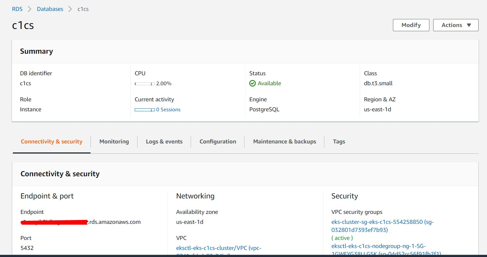

# DeployC1CS-EKS-RDS
Passo a passo de como realizar o deploy o C1CS em EKS com um banco de dados Externo (RDS).

# O que iremos precisar?

* Uma conta no Cloud One (não tem custo por 30 dias) - http://cloudone.trendmicro.com/
* Licença para o Smart Check https://www.trendmicro.com/product_trials/download/index/us/168
* Uma conta na AWS - https://portal.aws.amazon.com/billing/signup
* AWS CLI - https://docs.aws.amazon.com/cli/latest/userguide/cli-chap-install.html
* kubectl - https://kubernetes.io/docs/tasks/tools/install-kubectl/
* eksctl - https://github.com/weaveworks/eksctl
* helm - https://docs.aws.amazon.com/eks/latest/userguide/helm.html
* Docker

# Topologia

# Criando o Cluster EKS

* Efetue login na sua conta AWS utilizando o AWS Config.
* Tenha em mente o nome da sua chave .pem e altere ou crie uma nova, no exemplo abaixo o nome da minha chave é my_key_name.

* Crie um arquivo .yml (meuclustereks.yml) com o conteudo abaixo:

```
kind: ClusterConfig

metadata:
  name: NAME-CLUSTER
  region: us-east-1

nodeGroups:
  - name: ng-1
    instanceType: t2.medium
    desiredCapacity: 3
    ssh: # use existing EC2 key
      publicKeyName: my_key_name
    iam:
      withAddonPolicies:
        imageBuilder: true
        autoScaler: true
        externalDNS: true
        certManager: true
        appMesh: true
        appMeshPreview: true
        ebs: true
        fsx: true
        efs: true
        albIngress: true
        xRay: true
        cloudWatch: true
 ```
Aplique as configurações: eksctl create cluster -f meuclustereks.yml

A criação do cluster pode levar alguns minutos.

# Configurando o RDS

Efetue login na console da AWS, no menu de busca procure por RDS. Modifique os sequintes parâmetros:

* Create database > PostresSQL (selecione a versão 11.10-R1)
* Templates > Dev/Test
* Settings (Defina uma nome e coloque as credenciais)
* DB instance class > Burstable classes (db.t3.small)
* Connectivity (Selecione as VPC, Subnet e Security Group do cluster EKS)
* Clique em Create Database

 </img>

# Gerando o certificado para comunicação segura com o banco

Por padrão o RDS já tem ssl habilitado, iremos ajustar o certificado para que o Smart Check consiga se comunicar com o RDS.

# Instalando o Smart Check com banco Externo

Adicione as seguintes informaçções no overrides.yaml, inserindo sua própria senha para sua instância RDS e também o endpoint como o host.

```
db:
    user: smartcheck
    password: my_passwrd
    host: myrds.nomealeatorio.us-east-1.rds.amazonaws.com
    port: 5432
    tls:
        ca:
            valueFrom:
                configMapKeyRef:
                    name: dssc-db-trust
                    key: ca

activationCode: XX-XXXX-XXXXV-XXXXX-XXXXX-XXXXX-XXXXX

auth:

    secretSeed: trendmicro
```
